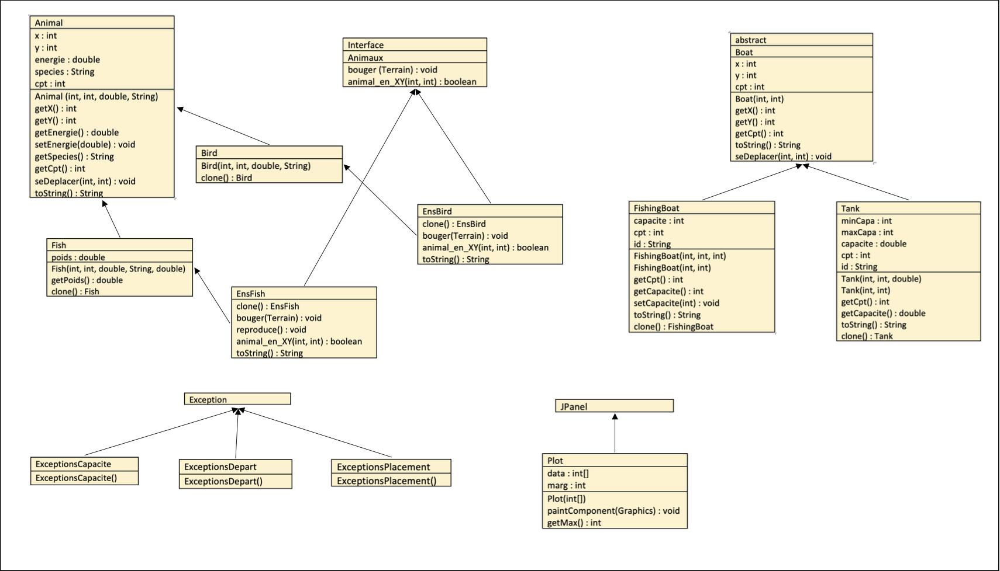
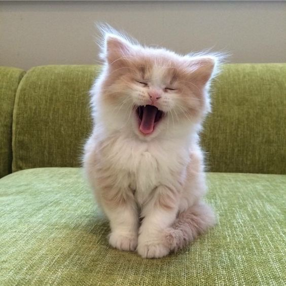

> Réalisé par Vu Hoang Thuy Duong <br>
Numéro d'étudiant : 21110221 <br>
Groupe : 7 <br>

# La Marée noire
## Prologue
Ce projet vise à réaliser une <strong>simulation simple de la pêche et du phénomène de la Marée noire</strong>, qui consiste principalement à faire comprendre mieux l’impact sérieux de ce genre de catastrophe ayant lieu fréquemment dans la mer. <br>
La simulation aura lieu sur un <strong>Terrain</strong> de dimension 20x20, dont les <strong>Ressources</strong> sont : algues, coraux et rochers; les <strong>Agents</strong> viennent de 2 types : Animaux et Bateaux. Nous allons prendre en argument 2 types d’animaux : les oiseaux sur mer et les poissons, dont chaque type d’animal recevra différent chaine indiquant leur race. Pour les bateaux, on suppose 2 types : bateaux de pêches et les conteneurs transportant l’essence dans la mer. <br><br>
Ce projet est réalisé dans le cadre du projet de fin semestre, contribuant 10% de la note totale de l'UE 2IN002 - Introduction à la Programmation Orientée Objet que propose Sorbonne Université durant le premier semestre en L2 Informatique. <br>
Vous pouvez retrouvez ci-dessous la liste des methodes accessibles à partir des classes définies dans ce projet (non compris les accesseurs aux variables **protected** et **private**). 
## UML simple
> Simulation not included
<p align="center"></p>
## Agent : les animaux
### interface Animaux
```
public void bouger(Terrain t);
```
Faire bouger tout un ArrayList de type Animal, définir concrètement dans les classes filles
```
public boolean animal_en_XY(int x, int y);
```
Vérifier s'il existe un animal au coordonnée [x,y] dans l'input
### class Animal
```
public void seDeplacer(int xnew, int ynew);
```
Déplacer l'animal au coordonnée [xnew, ynew]
```
public String toString();
```
Renvoie toutes les informations de l'animal
### class Bird 
> extends Animal
```
public Bird clone();
```
Instruction de clone de type Bird
### class Fish 
> extends Animal
```
public Fish clone();
```
Instruction de clone de type Fish
### class EnsBird 
> extends ArrayList< Bird > implements Animaux
```
public EnsBird clone();
```
Instruction de clone de type EnsBird 
> @Override
```
public void bouger(Terrain t);
public boolean animal_en_XY(int x, int y);
```
Méthodes redéfinies <em>Overrided</em> depuis l'interface Animaux
```
public String toString();
```
Renvoie l'information de tous les oiseaux contenus dans EnsBird
### class EnsFish
> extends ArrayList< Fish > implements Animaux
```
public EnsFish clone();
```
Instruction de clone de type EnsFish 
> @Override
```
public void bouger(Terrain t);
public boolean animal_en_XY(int x, int y);
```
Méthodes redéfinies <em>Overrided</em> depuis l'interface Animaux
```
public String toString();
```
Renvoie l'information de tous les oiseaux contenus dans EnsFish
```
public void reproduce();
```
Faire reproduire les poissons
## Agent : les bateaux
### abstract class Boat
```
public abstract String toString();
```
Méthode abstraite qui sera définie prochainement dans les classes filles
```
public void seDeplacer(int xnew, int ynew);
```
Faire déplacer les bateaux au coordonnée [xnew, ynew] dans l'input
### class FishingBoat
> extends Boat
```
public void setCapacite(int c);
```
Modifie la capacité du bateau
```
public String toString();
```
Définition de la méthode toString() à partir de sa méthode abstraite dans la classe mère
```
public FishingBoat clone();
```
Instruction clone de type FishingBoat
### class Tank
> extends Boat
```
public String toString(); 
```
Définition de la méthode toString() à partir de sa méthode abstraite dans la classe mère
```
public Tank clone();
```
Instruction clone de type Tank
## Simulation 
```
public void ajoutBoat(Boat b) throws ExceptionsPlacement;
```
Ajouter un bateau b dans l'ArrayList de bateaux de pêche. Rattraper l'exception de placement au cas où les coordonnées du bateau restent hors zone étudié
```
public void rafraichir_fish();
```
3 étapes principales : <br>
* faire bouger les animaux
* baisser l'énergie des animaux (sauf s'il y a des algues au même coordonnée qu'animal, son énergie cumule une même quantité que celle des algues, et on initialise la quantité des algues à temp_repousse_algue)
* faire reprodure les animaux
```
public void rafraichir_monde();
```
Cumule la quantité des ressources de 1 à chaque appel à cette fonction
```
public void fishing();
```
Pêcher les poissons
```
public void tragedy() throws ExceptionsCapacite, ExceptionsDepart;
```
Initier la tragédie de Marée noire en rattrapant 2 type d'exception de capacité et de départ
```
public void depart();
```
Faire partir les bateaux restant au port
```
public String toString(); 
```
Renvoie une image concrète et simplifiée du Terrain
## Exception
```
public class ExceptionsCapacite extends Exception;
```
Exception concernant la capacité des conteneurs
```
public class ExceptionsDepart extends Exception;
```
Exception concernant le départ du conteneurs
```
public class ExceptionsPlacement extends Exception;
```
Exception concernant l'emplacement des bateaux sur le Terrain
## class Plot
> extends JPanel 

Réaliser un graphe montrant le nombre d'animaux affecté lors du catastrophe de la Marée noire

## Remerciement
Je tiens à exprimer mes sincères remerciements à mes professeurs, notamment les chargés du groupe 7 Informatique pour des lecons de Programmation Orienté Objet qui m'intéressent vraiment et qui m'ont donné une telle motivation depuis le début des cours. <br>
Et merci beaucoup à vous tous à avoir jeté un coup d'oeil sur ce projet simple de simulation maritime :) <br>
<p align="center"></p>
